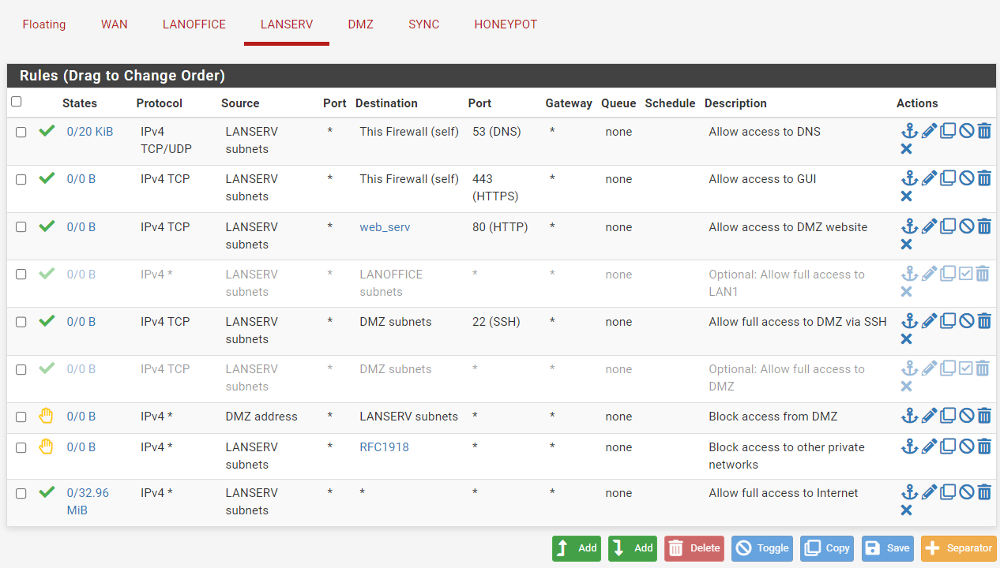
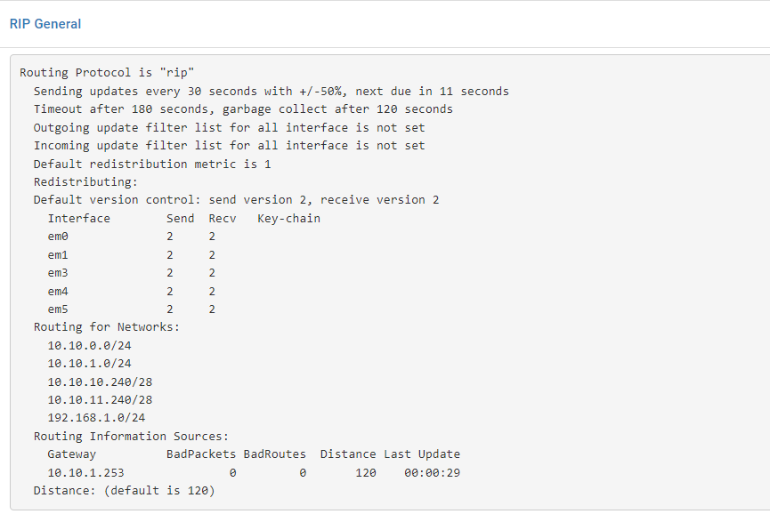

# 4. Configuration des hôtes

## 4.1. Serveurs pfSense

**Attention** : Il est important de rappeler que deux serveurs pfSense sont à configurer (il est à vous de décider lequel est le principal et lequel est le secondaire). Il est conseillé de bien faire attention à quelle machine est concernée par chaque étape de la configuration, puisque **même après la configuration de la synchronisation, certaines manipulations devront être réalisées sur les deux machines**.

La configuration suivante part du principe que le système d'exploitation a été installé au préalable selon les paramètres désirés et que la machine affiche cet écran :


**Note** : Tant que le pare-feu n'a pas été configuré, il faudra désactiver celui-ci avec la commande `pfctl -d` dans l'**option 8 du menu** afin de pouvoir accéder à l'interface graphique du routeur. Cette désactivation du pare-feu **ne persiste pas après un redémarrage**.
### 4.1.1. Configuration des interfaces

Une fois le système installé, chaque NIC doit être attribuée à la bonne interface et recevoir une adresse IP. De base, comme montré sur l'image précédente, seule deux interfaces sont actives, les autres étant masquées.

Tant que les interfaces ne sont pas nommées, il faut partir des correspondances suivantes :

| Nom par défaut de l'interface | Nom final  |
| ----------------------------- | ---------- |
| LAN                           | LAN-OFFICE |
| OPT1                          | LAN-SERV   |
| OPT2                          | DMZ        |
| OPT3                          | SYNC       |
| OPT4                          | HONEYPOT   |

#### 4.1.1.1. Attribution des interfaces

Il est possible d'attribuer chaque carte réseau à la bonne interface en utilisant l'**option 1 du menu**.
L'attribution doit être réalisée **sur les deux machines**. Le résultat devrait être de cet ordre :


Les interfaces doivent **être assignées dans le même ordre et avec le même nom sur les deux serveurs**.

#### 4.1.1.2. Attribution des IP

Les adresses IP doivent être configurées avec l'**option 2 du menu**. Elles doivent être configurées sur les **deux serveurs** et doivent être différentes sur les deux machines.

**Chaque attribution doit se faire de manière suivante :**
- Les IP doivent être statiques (et non entrées par DHCP) ;
- Ne pas configurer d'IPv6
- Ne pas activer de DHCP
- Ne pas changer le protocole du `webConfigurator`

Les adresses `WAN` sont propres à votre réseau relié à Internet, c'est à vous de les définir. Celles utilisées dans l'exemple, entre crochets, doivent être remplacées par les IP fixes relatives à votre `WAN`.
###### `PF_MASTER`

| Interface        | IP                 | Masque   | Passerelle          |
| ---------------- | ------------------ | -------- | ------------------- |
| WAN              | \[ 192.168.1.52 \] | \[ 24 \] | \[ 192.168.1.254 \] |
| LAN (LAN-OFFICE) | 10.10.0.252        | 24       | *(none)*            |
| OPT1 (LAN-SERV)  | 10.10.0.252        | 24       | *(none)*            |
| OPT2 (DMZ)       | 10.10.10.252       | 28       | *(none)*            |
| OPT3 (SYNC)      | 172.16.0.252       | 28       | *(none)*            |
| OPT4 (HONEYPOT)  | 10.10.11.252       | 29       | *(none)*            |
###### `PF_BACKUP`

| Interface        | IP                 | Masque   | Passerelle         |
| ---------------- | ------------------ | -------- | ------------------ |
| WAN              | \[ 192.168.1.53 \] | \[ 24 \] | \[ 192.168.1.53 \] |
| LAN (LAN-OFFICE) | 10.10.0.253        | 24       | *(none)*           |
| OPT1 (LAN-SERV)  | 10.10.0.253        | 24       | *(none)*           |
| OPT2 (DMZ)       | 10.10.10.253       | 28       | *(none)*           |
| OPT3 (SYNC)      | 172.16.0.253       | 28       | *(none)*           |
| OPT4 (HONEYPOT)  | 10.10.11.253       | 29       | *(none)*           |

Une fois l'IP configurée sur le `WAN`, nous pouvons accéder à ceux-ci par leur adresse IP par le biais d'une machine connectée sur le même réseau. A noter qu'il faudra réaliser la commande citée en haut de cette partie (`pfctl -d`) afin de pouvoir accéder au GUI.
### 4.1.2. Paramétrage basique des serveurs
#### 4.1.2.1. Nom d'hôte et domaine

Sur le GUI des **deux serveurs**, dans l'onglet `System > General Setup`, veillez à modifier le `hostname` et le `domain` selon les paramètres voulus.

`PF_MASTER` :
- Hostname : `pf_master`
- Domain : `infra_lan`
  `PF_BACKUP` :
- Hostname : `pf_backup`
- Domain : `infra.lan`

#### 4.1.2.2. Noms d'interfaces

Sur le GUI des **deux serveurs**, dans l'onglet `Interfaces > Assignements`, sur toutes les interfaces portant un nom temporaire (`LAN` et `OPT*`), veillez à modifier leur `Description` selon le tableau de correspondance plus haut.

Sur toutes les interfaces, veillez à décocher l'option en bas de page `Block private networks and loopback addresses`.

### 4.1.3. Configuration de la haute disponibilité (`failover`)

Les deux serveurs, bien qu'ils présentent des IP différentes à des fins de bon fonctionnement, devront apparaître comme un seul routeur pour toutes les autres machines du réseau.

Le principe de la [haute disponibilité](https://docs.netgate.com/pfsense/en/latest/recipes/high-availability.html#table-ha-lan-ip-address-assignments) (`High Availability`) est de leur attribuer une IP virtuelle commune sur chaque interface, qui sera celle utilisée par toutes les autres machines du réseau. Ainsi, en cas de panne, `PF_BACKUP` prendra le relais mais puisque l'adresse virtuelle n'aura pas changé, ce relais sera réalisé en toute transparence pour les utilisateurs.

Il convient donc dans un premier temps de définir les IP virtuelles :

| Interface  | CARP VIP           | Masque |
| ---------- | ------------------ | ------ |
| WAN        | \[ 192.168.1.54 \] | 24     |
| LAN-OFFICE | 10.10.0.254        | 24     |
| LAN-SERV   | 10.10.1.254        | 24     |
| DMZ        | 10.10.10.254       | 28     |
| HONEYPOT   | 10.10.10.254       | 28     |

L'interface `SYNC` n'est pas concernée, puisqu'aucune machine externe n'y accèdera : son seul but est de synchroniser les paramètres de `PF_MASTER` avec `PF_BACKUP`.

#### 4.1.3.1. Mise en place de la synchronisation

##### Interface `SYNC`

Pour permettre la synchronisation de configuration des pfSense par l'interface `SYNC`, les règles suivantes doivent être mises en place **sur les deux serveurs**, dans l'onglet `Firewall > Rules > SYNC` :


##### Configuration du State Synchronisation

Sur `PF_MASTER` **puis** sur `PF_BACKUP`, dans l'onglet `System > High Avail Sync :
- Checker `Synchronise States` ;
- Mettre la valeur de `Synchronize Interface` à `SYNC` ;
- Remplir le `Filter Host ID` (`1` sur `PF_MASTER`, `2` sur `PF_BACKUP`) ;
- Remplir `pfsync Synchronize Peer IP` avec l'IP `SYNC` de l'autre serveur ;
- Cliquer sur `Save`.

Sur `PF_MASTER` **seulement**, dans l'onglet `System > High Avail Sync` :
- Remplir `Synchronize Config to IP` à l'IP `SYNC` de `PF_BACKUP` (172.16.0.252) ;
- Remplir `Remote System Username` à `admin` ;
- Remplir `Remote System Password` à la valeur du mot de passe (`pfsense` par défaut) ;
- Cocher toutes les cases de `Select options to sync`.

La synchronisation devrait être complète et peut être vérifiée par exemple en ajoutant une règle de pare-feu dans `PF_MASTER`, qui devrait automatiquement être copiée à `PF_BACKUP`.

#### 4.1.3.2. Configuration des IP Virtuelles `CARP`

**Sur `PF_MASTER` seulement**, dans l'onglet `Firewall > Virtual IP`, cliquer sur `+` pour créer une nouvelle IP virtuelle, pour chaque interface concernée (voir le tableau `4.3.1`), avec les paramètres suivants :
- `Type` : `CARP`
- `Interface` : Interface choisie pour la `VIP`
- `Addresses(es)` : `CARP VIP` et `Masque` correspondant à l'interface choisie dans `4.3.1
- `Virtual IP Password` : Créer un password pour l'interface (ne sert qu'à être partagé entre les deux serveurs)
- `VHID Group` : Identificateur du `CARP VIP`. Doit être différent pour chaque interface, une technique commune est de se baser sur un octet du réseau.
- `Advertising frequency` : `1` (doit être identiques les deux serveurs)
- `Skew` : `O`
- `Description` : par exemple, `WAN CARP VIP`.

**Note**:
- Le `Skew` est de `1` pour le `primary node` et doit être au-dessus de `100` pour des nodes secondaires. Si la synchronisation fonctionne correctement, il sera automatiquement mis à `100` sur `PF_BACKUP` sans devoir être modifié à la main.


#### 4.1.3.4. Configuration de l'`Outbound NAT` pour le `CARP`

Sur `PF_MASTER` **seulement**, dans `Firewall > NAT > Outbound` :
- Cocher `Mode` : `Hybrid Outbound NAT rule generation`.

En plus des deux règles automatiques, créer les `mappings` suivants :


Une fois ces règles mises en place, il est possible de vérifier l'état des serveurs dans `Status > CARP (failover)`.
##### `PF_MASTER`

##### `PF_BACKUP`


### 4.1.4. Règles de base du pare-feu

Les règles de pare-feu doivent être mises en place **uniquement par `PF_Master`** et dans `Firewall > Rules`, sur l'interface choisie.

#### 4.1.3.0. Aliases

Des aliases peuvent être définis pour contenir des adresses IP ou des plages d'adresse IP sans avoir à les écrire en brut à plusieurs endroits. Ces aliases permettent une modification rapide et dynamiques des adresses qu'ils contiennent.

Dans l'onglet `Firewall > Aliases` :

#### 4.1.3.1. `WAN`

#### 4.1.3.2. `LAN-OFFICE`


#### 4.1.3.3. `LAN-SERV`


#### 4.1.3.4. `DMZ`


#### 4.1.3.5. `SYNC`


#### 4.1.3.5. `HONEYPOT`

### 4.1.4. DHCP

Le DHCP doit être activé **uniquement par `PF_Master`** et dans `Services > DHCP Server`, sur l'interface choisie.

Dans l'architecture présentée, seul le réseau `LAN-OFFICE` dispose d'une pool DHCP, les autres sous-réseaux étant tous des réseaux de maintenance ou des réseaux exclusivement occupés par des serveurs.

S'il devait être mis en place sur d'autres interfaces, il est conseillé de suivre les mêmes étapes de configuration que pour `4.1.4.1`, à l'exception évidemment des adresses IP concernées.

#### 4.1.4.1. `LAN-OFFICE`

Dans `Services > DHCP Server` :
- Cocher `Enable DHCP server on LANOFFICE interface`
- `Address Pool Range` : `10.10.0.1` to `10.10.0.200`
- `DNS Servers` : IP virtuelle du pare-feu sur l'interface concernée, ici `10.10.0.254`
- `Gateway` : IP virtuelle du pare-feu sur l'interface concernée, ici `10.10.0.254`
- `Failover peer IP` : IP de `PF_BACKUP` sur l'interface concernée, ici `10.10.0.253`

S'il devait exister des IP fixes sur l'interface concernée (par exemple si l'on activait le DHCP sur l'interface `LAN-SERV`, contenant le serveur `web-backup`), il est fortement conseillé de rentrer les IP fixes du réseau dans les `DHCP Static Mappings`, tout en bas de la page.

De la même façon, il est conseillé d'exclure des pools DHCP les adresses réelles et virtuelle des routeurs pfSense.

L'état et les bails du serveur DHCP peuvent être vérifiés dans `Status > DHCP Leases` :


### 4.1.5. DNS

Le serveur DNS s'active **uniquement sur `PF_MASTER`**, dans `Services > DNS Resolver > General Settings` :
- Cocher `Enable DNS Server` ;
- Mettre `All` sur `Network Interfaces` ;
- Mettre `All` sur `Outgoing Network Interfaces` ;
- Cocher `Register DHCP leases in the DNS resolver` ;
- Cocher `Register DHCP static mappings in the DNS Resolver`.

On peut enregistrer de nouvelles IP au DNS dans la partie `Host Overrides` en bas de page.

Dans le cadre de la mise en place du serveur web, dont le FDQN et l'adresse IP sont connus en avance, on peut déjà y ajouter l'entrée :

### 4.1.5. Port Forwarding

Les règles de Port Forwarding s'activent **uniquement sur `PF_MASTER`**, dans `Firewall > NAT > Port Forward`.

Puisque l'IP et le port du site web, devant être accessibles depuis l'extérieur, sont déjà connus, on peut créer la règle de port forwarding dès maintenant. Le but du port forward est d'intercepter une requête reçue du `WAN` vers un port spécifique du serveur (ici `80`) afin de renvoyer cette requête vers le port d'une machine normalement inaccessible.


A noter toutefois que le WAN n'aura pas accès à l'entrée DNS correspondant au serveur web et devra passer directement par la `CARP VIP` des routeurs pfSense dans le `WAN`, sauf si les machines voulant accéder au site entrent la `CARP VIP` des routeurs pfSense dans leurs `DNS`.

### 4.1.6. RIPv2

Puisque l'utilisation du protocole dynamique de routage `RIPv2` passe par l'utilisation d'un package, son installation et sa configuration ne sont pas incluses dans les paramètres automatiquement synchronisés entre les deux pfSense.

De cette façon, **toutes les manipulations suivantes sont à réaliser sur `PF_MASTER` et sur `PF_BACKUP`.**
#### 4.1.6.1. Installation du package `FFR`

Dans `System > Package Manager`, rechercher et installer le package `ffr` :  


#### 4.1.6.2. Configuration du routage par RIPv2

Dans `Services > FRR > Global Settings` :
- Cocher `Enable FRR` ;
- Entrer un `Master Password`.

Dans `Services > FRR > RIP > RIP`
- Cocher `Enable RIP Routing` ;
- Dans `RIP Networks`, entrer les adresse réseau et masque de toutes les interfaces concernées (toutes sauf `SYNC`) ;
- Dans `RIP Version`, entrer `RIPv2` ;
- Cliquer sur `Save`.

Le fonctionnement du protocole de routage peut être vérifié dans `Services > FRR > Status > RIP` :

### 4.1.7. Portail captif

TODO
### 4.1.8. Sauvegarde automatique de la configuration

L'administrateur peut choisir de réaliser les sauvegardes automatiques seulement sur `PF_MASTER`, ou sur `PF_MASTER` et `PF_BACKUP`. Dans les deux cas, la procédure est la même et doit être réalisée sur chaque machine, dans `Services > Auto Configuration Backup > Settings` :
- Cocher `Enable automatic configuration backup` ;
- Pour réaliser une backup journalière, cocher `Automatically backup on a regular schedule` et entrer `5 | 0 | * | * | *` dans `Schedule` ; sinon, cocher `Automatically backup on every configuration change` ;
- Par sécurité, entrer un mot de passe dans `Encryption Password` ;
- Dans `Manual backups to keep`, la valeur est libre ; ici nous mettrons `20` backups manuelles sur le total de `100` backups conservées ;
- Cocher `List backups in descending order`.

Les backups peuvent être récupérées dans `Services > Auto Configuration Backup > Restore`.

### 4.1.9. Proxy Inverse

TODO
## 4.2. Serveur web (DMZ)

### 4.2.1. Configuration initiale

| Hostname                  | web-server            |
| ------------------------- | --------------------- |
| **Domaine**               | infra.uf              |
| **Nom de l'utilisateur**  | web-server            |
| **Adresse IP**            | 10.10.10.242          |
| **Masque de sous-réseau** | 255.255.255.248 (/28) |
| **Passerelle par défaut** | 10.10.10.254          |
| **DNS**                   | 10.10.10.254          |
| **Ports ouverts**         | 80 (http), 22 (ssh)   |

Il est conseillé d'utiliser le [script d'installation pour Rocky Linux 8.x](https://gitlab.com/kikinovak/rocky-8-server) proposé par [https://www.microlinux.fr/](Nicolas Kovacs), qui propose d'assainir une machine afin de la rendre plus facilement utilisable en tant que serveur.

Installer, si manquants après assainissement, les composants applicatifs vus dans `3.2.2`.

###  4.2.2. Mise en place du serveur web

Afin de lancer le serveur Apache de manière permanente, réaliser la commande suivante :
```bash
systemctl enable httpd --now
```

Pour vérifier le bon fonctionnement du serveur il est possible d'installer le package `elinks` et réaliser la commande suivante :
```
elinks http://localhost
```

Il suffit de modifier le contenu du dossier `var/www/html` afin de modifier le site web qui s'affichera sur la page. Si les règles de pare-feu (`TODO`) et de port forward (`TODO`) ont été réalisées pour `web-server`, le site est désormais accessible sur tous les réseaux à l'adresse `10.10.10.242:80`.

Si l'entrée correspondant à `web-server` a été ajoutée au DNS (`TODO`), tous les réseaux internes pourront accéder au site web à l'adresse `documentation.infra.lan:80`.

### 4.2.3. Mise en place des fichiers de restauration

Les dossiers suivants et leurs permissions doivent être mis en place en `sudo` sur la machine :
```txt
/home/			           	(755)
	web-server/			(755)
		scripts/	     	(755)
		    restore.sh	(700)
		temp/			    (777)
```

Le fichier `/home/web-server/scripts/restore.sh` doit contenir ce qui suit :
```bash
#!/bin/bash
# Checks arguments
if [ $# -lt 1 ]; then
echo 1>&2 "ERREUR: Argument manquant (nom du fichier à utiliser, situé dans le dossier ../temp)"
exit 2
elif [ $# -gt 1 ]; then
echo 1>&2 "ERREUR: Trop d'arguments (nom du fichier à utiliser seulement)"
exit 2
fi

# Takes first argument as filename
filename=$1
# If said file doesn't exist:
if [ ! -f "/home/web-server/temp/${filename}" ]; then
echo "ERREUR: Le fichier mentionné n'existe pas"
exit 2
fi

if [ ! -d "/var/www/temp" ]; then
mkdir "/var/www/temp"
fi
if [ ! -d "/home/web-server/temp" ]; then
mkdir "/home/web-server/temp"
fi

file="${filename%%.*}"

rm -rf /var/www/html/* /var/www/temp/* /var/www/temp/*
tar xfz /home/web-server/temp/$filename -C /var/www/temp/ # Uncompresses the tar file
mv /var/www/temp/"$file"/* /var/www/html/ # Moves the uncompressed files from the backup folder to the html folder
rm -rf /var/www/temp /home/web-server/temp/ # Removes the temp folder
```
## 4.3. Serveurs web-backup (LAN-SERV)

### 4.3.1. Configuration initiale

| Hostname                  | web-backup          |
| ------------------------- | ------------------- |
| **Domaine**               | infra.uf            |
| **Nom de l'utilisateur**  | web-backup          |
| **Adresse IP**            | 10.10.1.242         |
| **Masque de sous-réseau** | 255.255.255.0 (/24) |
| **Passerelle par défaut** | 10.10.1.254         |
| **DNS**                   | 10.10.1.254         |
| **Ports ouverts**         | 22 (ssh)            |

Il est conseillé d'utiliser le [script d'installation pour Rocky Linux 8.x](https://gitlab.com/kikinovak/rocky-8-server) proposé par [https://www.microlinux.fr/](Nicolas Kovacs), qui propose d'assainir une machine afin de la rendre plus facilement utilisable en tant que serveur.

Installer, si manquants après assainissement, les composants applicatifs vus dans `3.2.2`.

**Note** : Il convient de se connecter une première fois en SSH au serveur web avant d'exécuter l'un des scripts.

### 4.2.3. Mise en place des fichiers de sauvegarde et de restauration

Les dossiers suivants et leurs permissions doivent être mis en place en `sudo` sur la machine :
```txt
/home/			           	    (755)
	backup-server/			    (755)
		backups/              (755)
		credentials/          (755)
			ws-ip.txt        (600)
			ws-pass.txt      (600)
		scripts/	     	    (755)
			backup.sh        (700)
			remove.sh        (700)
		    restore.sh	    (700)
		temp/			        (755)
```  

#### 4.2.3.1. Fichiers `/credentials/`

Dans le dossier `/home/backup-server/credentials/` :
- `ws-ip.txt` : contient l'IP du serveur web (ici `10.10.10.242`)
- `ws-pass.txt` : contient le mot de passe `root` du serveur web

#### 4.2.3.2. Fichiers `/scripts/`

Le fichier `/home/web-server/scripts/backup.sh` doit contenir ce qui suit :
```bash
#!/bin/bash

ip=$(</home/backup-server/credentials/ws-ip.txt)
filename="backup_"$(date +"%y-%m-%d_%H-%M-%S")

echo "RETRIEVING DATA FROM WEB SERVER... ($ip)"
sshpass -p "root" rsync -az -e ssh root@10.10.10.242:/var/www/html/ /home/backup-server/temp/"$filename"/
if [ "$?" -eq "0" ]
then
    cd /home/backup-server/temp
    tar cfz /home/backup-server/backups/"$filename".tar.gz "$filename"/
    #rm -rf /home/backup-server/backups/"$filename".tar.gz
    echo "Successfully created backup data."
else
    echo "ERROR: Something went wrong when trying to communicate with the web server."
fi

rm -rf /home/backup-server/temp/"$filename"/
```

Le fichier `/home/web-server/scripts/remove.sh` doit contenir ce qui suit :
```bash
#!/bin/bash

if [ -d "/home/backup-server/temp" ]
then
    rm -rf /home/backup-server/temp/*
    echo "Emptied temp folder."
fi

if [ -d "/home/backup-server/backups" ]
then
    find /home/backup-server/backups/*.tar.gz -mtime +0 -type f -delete
    echo "Successfully realised the operation."
    exit 0
else
    echo "ERROR: The directory doesn't exist."
    exit 1
fi
```

Le fichier `/home/web-server/scripts/restore.sh` doit contenir ce qui suit :
```sh
#!/bin/bash
# Retrieves the list of all the files in the backups folder.
files=($(find /home/backup-server/backups/ -mtime -8 -type f -exec basename {} \;))

# If there's no file:
if [ -z "$files" ]; then
   echo "No backup files available for restore."
   exit 1
fi

# Else:

# Orders the file array elements by name:
IFS=$'\n' files=($(sort <<< "${files[*]}"))
unset IFS

echo "Backup files available for restore:"
i=0
while [ $i -lt ${#files[@]} ]
do
   echo $i: ${files[$i]}
   ((i++))
done
printf '\n'
```

### 4.2.3. Mise en oeuvre des tâches automatiques

Il faut modifier le fichier de configuration de `crontab` (planificateur de tâches intégré à l'OS) pour exécuter la sauvegarde et la suppression des anciennes backups, avec `crontab -e` :

```bash
 0 1 * * * /home/backup-server/scripts/backup.sh
 5 1 * * * /home/backup-server/scripts/remove.sh
```

Ici, la sauvegarde et la suppression s'exécuteront respectivement à 1h00 et 1h05.

## 4.4 Serveur honeypot (HONEYPOT)

### 4.4.1. Configuration initiale 


| Hostname                     | very-important-and-private-and-secret-server                    |
|------------------------------|-----------------------------------------------------------------|
| **Domaine**                  | infra.uf                                                        |
| **Nom de l'utilisateur**     | user                                                            |
| **Adresse IP**               | 10.10.11.242                                                    |
| **Masque de sous-réseau**    | 255.255.255.240 (/28)                                           |
| **Passerelle par défaut**    | 10.10.11.254                                                    |
| **DNS**                      | 10.10.11.254                                                    |
| **Ports ouverts (honeypot)** | 80, 8080, 20, 21, 22, 23, 25, 443, 8443, 53                     |
| **Ports ouverts (réels)**    | 64295 (ssh), 64297 (https, monitoring), 64294 (https, admin-ui) |


T-Pot est une plateforme honeypot open-source tout-en-un qui intègre plusieurs honeypots et outils de sécurité pour la détection et l'analyse des menaces cyber. T-Pot vise à simplifier le processus de déploiement et de gestion des honeypots pour les organisations. Il sert de solution complète de honeypot qui peut être adaptée pour répondre à des besoins de sécurité spécifiques.

Pour mettre en place le honeypot, il sera nécessaire de l'installer sur un serveur. Par défaut, un serveur Ubuntu a été sélectionné pour cette installation.

### 4.4.2 Installation de T-Pot sur le serveur
1. Clonez le dépôt Github : `$ git clone https://github.com/telekom-security/tpotce`
2. Accédez au dossier tpotce/ : `$ cd tpotce`
3. Lancez le script d'installation : `$ ./install.sh`
4. Suivez les instructions de l'installateur et entrez votre mot de passe si nécessaire. Le type d'installation souhaité vous sera demandé, il faudra indiquer `h` pour HIVE. Il faudra aussi renseigner un nom d'utilisateur et un nouveau mot de passe pour l'interface Web.
5. Vérifiez attentivement les messages de l'installateur pour détecter d'éventuelles erreurs ou conflits de ports.
6. Redémarrez votre machine : `$ sudo reboot`

Une fois la machine redémarrée, vérifiez l'état des images Docker avec `docker ps` et du service tpotce avec `sudo systemctl status tpotce`.

### 4.4.3 Configuration du pare-feu dans T-Pot (UFW)

Autorisez l'ouverture des ports qui vont être exposés :

```bash
sudo ufw allow from any to <ip-tpot> port 80 proto tcp
sudo ufw allow from any to <ip-tpot> port 8080 proto tcp
sudo ufw allow from any to <ip-tpot> port 20 proto tcp
sudo ufw allow from any to <ip-tpot> port 21 proto tcp
sudo ufw allow from any to <ip-tpot> port 22 proto tcp
sudo ufw allow from any to <ip-tpot> port 23 proto tcp
sudo ufw allow from any to <ip-tpot> port 25 proto tcp
sudo ufw allow from any to <ip-tpot> port 443 proto tcp
sudo ufw allow from any to <ip-tpot> port 8443 proto tcp
sudo ufw allow from any to <ip-tpot> port 53 proto udp
```

Ensuite, activez la journalisation du pare-feu avec `sudo ufw logging on`

### 4.4.4. Règles de pare-feu et port-forwarding (pfSense)

TODO

## 4.6. PC clients

Les PC client (Windows ou Linux) n'ont pas de configuration particulière spécifiée dans le cahier des charges. Elles n'ont pas d'impératif de nomenclature pour les noms des machines et utilisateurs, ni de logiciels hors ceux spécifiés plus tôt.

Tant qu'ils sont reliés au réseau `LAN-OFFICE`, leurs paramètres réseau seront configurés automatiquement, par DHCP. Elles récupéreront ainsi une IP libre de la pool DHCP de `LAN-OFFICE`.