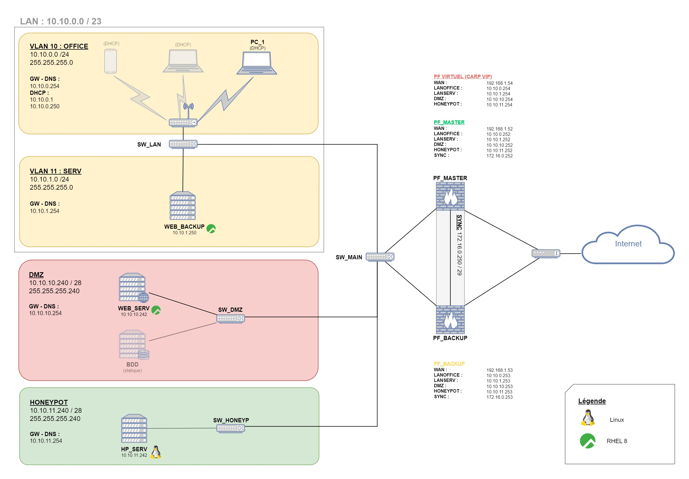
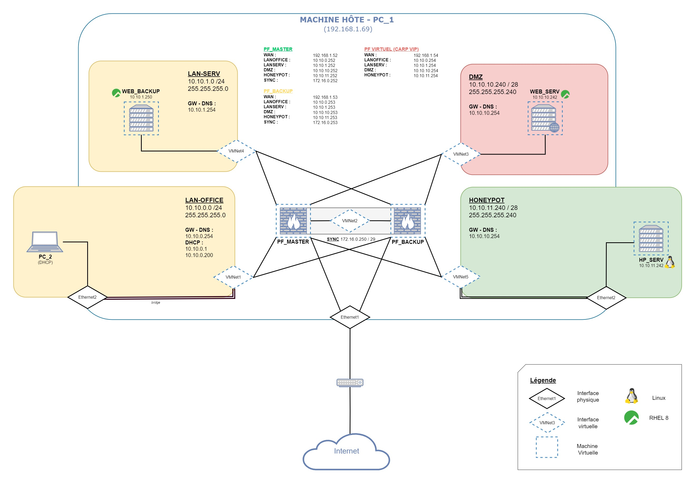

# 2. Infrastructure générale

## 2.1. Topologie du réseau

### 2.1.1. Topologies physique et virtuelle

Idéalement, l'architecture présentée par ce document devrait être totalement matérielle, c'est-à-dire contenir un certain nombre de routeurs, commutateurs, serveurs physiques, PCs client, etc.

*Topologie physique de l'architecture présentée*

Cependant, par manque matériel et financier, nous avons choisi de **virtualiser l'architecture** entre trois ordinateurs. La topologie suivante sera donc mise en place et appliquée lors de la démonstration au client :

*Topologie virtuelle de l'architecture présentée*
### 2.1.2. Différences notables

Ce projet a été réfléchi pour être réalisable de manière presque identique, que l'architecture soit physique ou virtualisée.

Il est à noter que puisque la topologie physique n'a pas pu être mise en place et testée, cette documentation s'appuiera sur la topologie virtuelle et n'entrera donc pas dans le détail de certaines configurations qui seraient à réaliser uniquement sur du matériel physique (routeurs par exemple).

Ainsi, puisqu'il n'a pas été possible de gérer des commutateurs réseau virtuels (du moins avec les différents logiciels de virtualisation testés), **aucun VLAN n'a pu être mis en place dans l'architecture virtualisée** : les deux VLANs `OFFICE` et `SERV` présents dans le sous-réseau `LAN` de l'architecture physique (en jaune) ont été entièrement séparés en sous-réseaux distincts `LAN-OFFICE` et `LAN-SERV`.
## 2.2. Définition des sous-réseaux

### 2.2.1. Réseau externe (`WAN`)

Ce réseau est celui qui permet l'accès à Internet.

**Attention** : Il est nécessaire de disposer de trois adresses IP fixes sur cette interface. Si ce n'est pas possible (ce qui sera le cas lors de la démonstration), il sera être nécessaire de mettre en place un réseau "proxy" entre l'extérieur et les routeurs pfSense et qui agira en qualité de `WAN` pour ceux-ci.
### 2.2.2. Réseaux internes (`LAN-OFFICE` et `LAN-SERV`)

Le groupe de réseaux `LAN-*`, originellement un seul réseau divisé en plusieurs VLAN, constituent ensemble le réseau interne de l'entreprise. Ils ne sont pas accessibles par les autres réseaux, ni par l'extérieur.

#### 2.2.2.1. `LAN-OFFICE`

Le réseau `LAN-OFFICE` est dédié aux PCs client et autres appareils utilisés par les employés de l'entreprise. Il n'a par défaut aucun accès vers `LAN-SERV`.

| Adresse du réseau         | 10.10.0.0 / 24 |
| ------------------------- | -------------- |
| **Masque de sous-réseau** | 255.255.255.0  |
| **IP disponibles**        | 254            |
| **Adresse de broadcast**  | 10.10.0.255    |

#### 2.2.2.2. `LAN-SERV`

Le réseau `LAN-SERV` est dédié aux serveurs internes de l'entreprise et non-exposés à l'extérieur (serveurs de sauvegardes ou de données par exemple). Des règles de trafic peuvent permettre si besoin d'accéder aux autres sous-réseaux (administration, accès au serveur web...)

| Adresse du réseau         | 10.10.0.1 / 24 |
| ------------------------- | -------------- |
| **Masque de sous-réseau** | 255.255.255.0  |
| **IP disponibles**        | 254            |
| **Adresse de broadcast**  | 10.10.0.255    |

### 2.2.3. Réseau dédié aux serveurs exposés (`DMZ`)

Le réseau `DMZ` est dédié aux serveurs de l'entreprise exposés à l'extérieur (serveur web, serveur mail ou API par exemple). Par mesure de sécurité, son accès à Internet doit être restreint au maximum aux services dont les serveurs ont besoin. Il n'est pas en mesure de communiquer avec les autres sous-réseaux.

| Adresse du réseau         | 10.10.10.240 / 28 |
| ------------------------- | ----------------- |
| **Masque de sous-réseau** | 255.255.255.240   |
| **IP disponibles**        | 14                |
| **Adresse de broadcast**  | 10.10.10.255      |

### 2.2.4. Réseau factice dédié à la cybersécurité (`HONEYPOT`)

Ce réseau `HONEYPOT` est dédié à des "fausses" machines, volontairement vulnérables, dont le seul but est de tromper un cyber-attaquant. Par mesure de sécurité, son accès à Internet doit être restreint au maximum aux services dont les serveurs ont besoin. Il n'est pas en mesure de communiquer avec les autres sous-réseaux.

| Adresse du réseau         | 10.10.11.240 / 28 |
| ------------------------- | ----------------- |
| **Masque de sous-réseau** | 255.255.255.0     |
| **IP disponibles**        | 14                |
| **Adresse de broadcast**  | 10.10.11.255      |

### 2.2.5. Réseau de synchronisation des routeurs pfSense (`SYNC`)

Le réseau `SYNC` n'a pour but que de synchroniser les configurations des deux serveurs pfSense. Il est entièrement coupé des autres réseaux et de l'extérieur.

| Adresse du réseau         | 172.16.0.248 / 29 |
| ------------------------- | ----------------- |
| **Masque de sous-réseau** | 255.255.255.240   |
| **IP disponibles**        | 6                 |
| **Adresse de broadcast**  | 172.16.0.255      |

Alternativement, s'il est possible d'utiliser un `/30` (ce qui n'est pas le cas avec VMWare par exemple), le réseau peut être réduit au tableau suivant :

| Adresse du réseau         | 172.16.0.252 / 30 |
| ------------------------- | ----------------- |
| **Masque de sous-réseau** | 255.255.255.252   |
| **IP disponibles**        | 2                 |
| **Adresse de broadcast**  | 172.16.0.255      |

[//]: # (## 2.4. Services permettant la prise en charge des communications réseau)
[//]: # ()
[//]: # (## 2.5. Services permettant de gérer la sécurité des réseaux)
