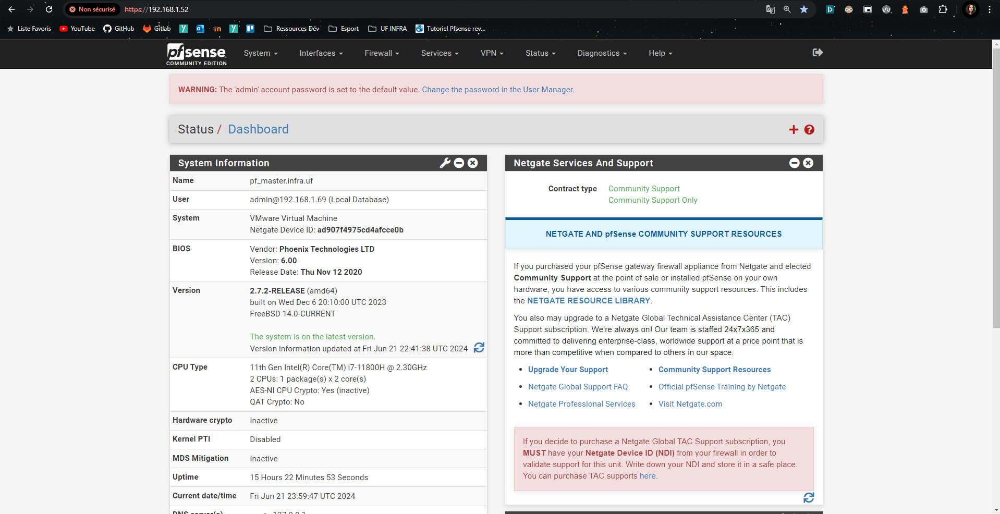
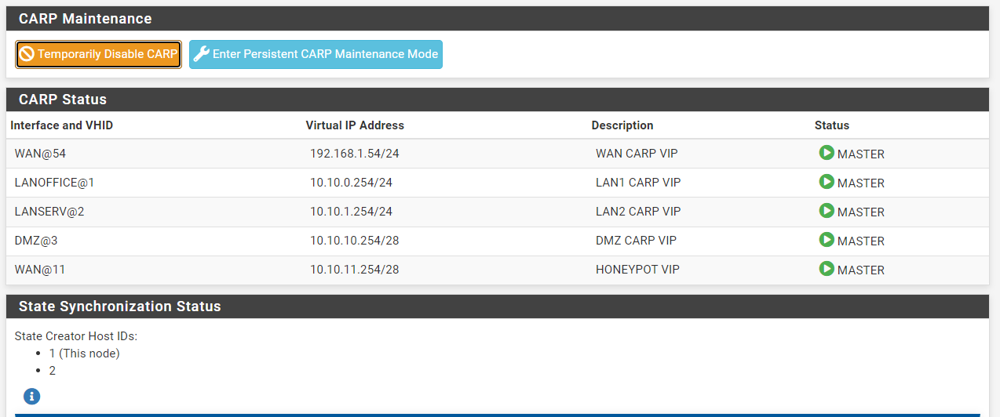
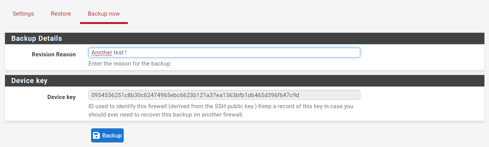
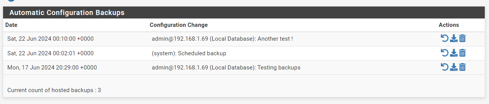

# 1. Gestion des outils et services liés à pfSense

## 1.1. Interface graphique de configuration

Par défaut, le configurateur graphique est accessible sur le port `HTTPS` de l'adresse IP pfSense du réseau dans lequel se situe l'hôte.

Si la configuration de la solution a été faite au complet, il est possible de s'y connecter depuis le `WAN` et depuis le `LAN-SERV`.

S'il ne semble pas possible de s'y connecter, l'administrateur peut tenter de désactiver les règles du pare-feu par le shell du pfSense avec la commande `` `pfctl -d` ``. Elles seront rétablies au prochain redémarrage du système.

*GUI de `PF_MASTER`*
## 1.2. Failover

Le statut des serveurs `PF_MASTER` et `PF_BACKUP` peut être vérifié dans `Status > CARP` :

*`PF_MASTER*

*`PF_BACKUP`*

## 1.2.1. Panne de `PF_MASTER`

En cas de déficience de `PF_MASTER`, qui ne répondrait pas à un ping de `PF_BACKUP`, celui-ci prendra automatiquement le relais en tant que routeur principal. Puisque les deux serveurs se trouvent derrière la même IP virtuelle, ce relais s'effectuera en toute transparence pour l'utilisateur, et aucune reconfiguration des hôtes ne sera à réaliser.

Une fois que `PF_MASTER` retourne en état de fonctionnement normal, il reprend son rôle et `PF_BACKUP` redevient inactif.

### 1.2.2. Maintenance

Il est possible d'entrer en maintenance ou de désactiver temporairement le CARP à travers les options présentes via `Status > CARP`.

## 1.3. Sauvegarde et restoration de la configuration

Après la mise en service de la solution, la backup automatique journalière a été mise en place (modifiable dans `Services > Auto Configuration Backup > Settings`).

### 1.3.1. Sauvegarde manuelle

Une sauvegarde manuelle peut être réalisée dans `Services > Auto Configuration Backup > Backup now`.

**Attention** : Il est conseillé de réaliser une sauvegarde manuelle des deux serveurs en même temps et d'éviter de ne sauvegarder que `PF_BACKUP`, dans la mesure où sa configuration dépend de celle de `PF_MASTER`.
### 1.3.2. Restoration d'une sauvegarde

Une sauvegarde peut être restaurée dans `Services > Auto Configuration Backup > Backup now` :

**Attention** : Il est fortement recommandé de restaurer les deux serveurs en même temps, avec des backups les plus proches possibles en termes d'heure et de jour de sauvegarde afin d'éviter une trop grosse asymétrie dans les configurations.

De plus, il est **déconseillé** d'utiliser une backup de `PF_BACKUP` sur `PF_MASTER` (sauf cas extrême) : toute la configuration du CARP failover sera à refaire, et elle est particulièrement difficile à réaliser correctement dans ce sens.