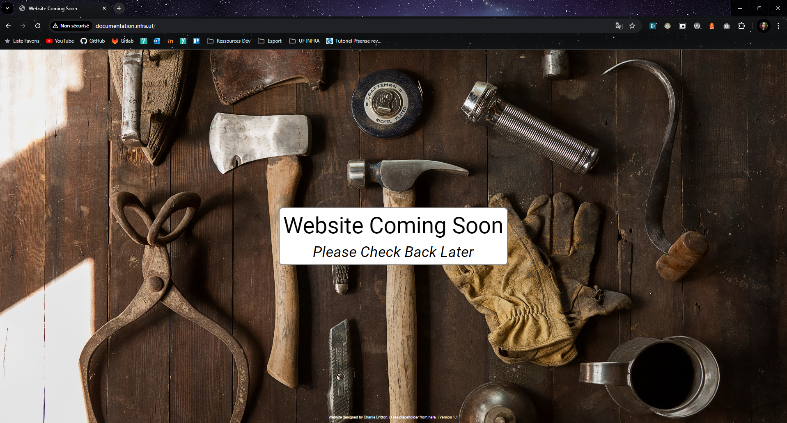
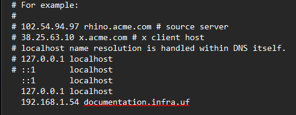
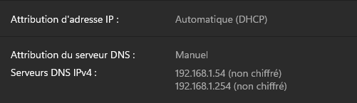

# 2. Accès au site web par les différents réseaux

## 2.1. Accès au site web

**Prérequis / troubleshooting** :
- Le serveur web `web-serv.infra.uf` doit se trouver à l'IP fixe `10.10.10.242` et être connecté aux routeurs `PF_MASTER` et `PF_BACKUP` ;
- Le service Apache `httpd` doit être en état de fonctionnement ;
- Les règles de pare-feu doivent permettre la communication du `LAN-OFFICE` vers le `DMZ` sur le port `80` pour que le site soit accessible depuis celui-ci ;
- Une correspondance `documentation.infra.uf` -> `10.10.10.242` doit avoir été entrée dans le `DNS` pour que le site soit accessible par cette URL dans les réseaux ayant accès au DNS ;
- Un règle de redirection de port (`port forward`) doit relier un port du `WAN` (par défaut `8080`) au port ouvert de `web-server` (par défaut `80`) pour que le site soit accessible depuis l'extérieur.

### 2.1.3. Depuis les réseaux internes (LAN-OFFICE)

Si tous les éléments précédents sont configurés, le site web devrait être accessible depuis le `LAN-OFFICE` par son URL `http://documentation.infra.uf` ou directement par son adresse IP `http://10.10.10.242`.

*Site accédé depuis le LAN-OFFICE par l'URL `documentation.infra.uf`.*
### 2.1.2. Depuis l'extérieur (WAN)

Si tous les éléments précédents sont configurés, le site web devrait être accessible depuis le `WAN` par l'une des trois adresses IP `WAN` (`PF_MASTER`, `PF_BACKUP` et `VIP`) des routeurs pfSense.

Il est à noter que par défaut, un client du `WAN` n'aura pas accès aux entrées du DNS et ne pourra pas accéder tel quel à `documentation.infra.uf`.

Deux solutions sont possibles :
- Le client peut ajouter le `hostname` et l'IP virtuelle du `WAN` dans son propre fichier `hosts` :
  
- Le client peut ajouter l'IP virtuelle du `WAN` dans la liste de ses DNS :
  
## 2.2. Maintenance du site web

Le site web peut être modifié en changeant les fichiers situés à `var/www/html`.

Il est important de noter que pour l'instant, le serveur web ne gère que des sites statiques et n'utilise aucun accès à un quelconque serveur externe.

En réactivant la règle de pare-feu de l'interface `DMZ` permettant l'accès à Internet, l'administrateur peut par exemple cloner un dépôt GitHub et placer les fichiers manuellement dans le dossier `/var/www/html`.