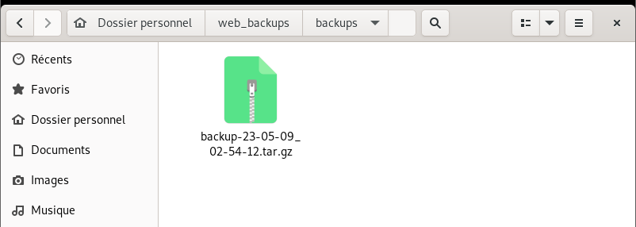
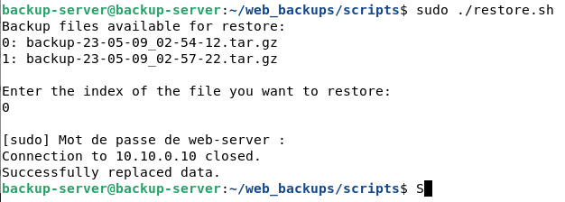
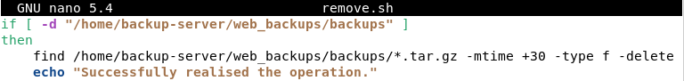

# 3. Gestion et sauvegarde des fichiers du serveur web

**Prérequis** :
- L'administrateur doit être connecté en `root` ou `sudo` au serveur de backup `web-backup` à l'adresse `10.10.1.242`.
- Une première connexion en `SSH` depuis `web-backup` vers le serveur web `web-serv` doit avoir été réalisée une première fois avant d'exécuter les scripts mentionnés ci-après.

Bien qu'il soit possible de se connecter à `web-backup` en `SSH`, il est fortement conseillé de réaliser les manipulations directement sur la machine.

## 3.1. Sauvegarde des fichiers

Le fichier de sauvegarde du serveur web se trouve au chemin `/home/backup-server/scripts/backups.sh`.

A l'exécution, le script établit une connexion par `SSH` à `web-serv`, y récupère les fichiers présents dans `/var/www/html/` et les compresse en une archive stockée dans son dossier `/home/backup-server/backups/`.

La nomenclature de ces fichiers est normée : elle contient la date et l'heure de la sauvegarde au format `YY-ss-DD_HH-MM-SS`.

### 3.1.1. Sauvegarde manuelle

Le fichier de sauvegarde `backup.sh` peut être appelé à n'importe quel moment et ne nécessite aucun paramètre pour s'exécuter correctement.
### 3.1.2. Sauvegarde automatique

Le serveur de backup gère les sauvegardes automatiques, tous les jours à une heure donnée, grâce à l'utilitaire de planificateur de tâches crontab.

Il est possible de modifier l'heure de sauvegarde en éditant l'avant-dernière ligne du fichier de configuration crontab, accessible par `` `sudo crontab -e` ``.

Par défaut, l'heure journalière de sauvegarde automatique se trouve à `1h00 AM`.

**Note** : Pour l'instant, `crontab` ne signale pas de plantage du processus.
## 3.2. Restoration des fichiers

Le fichier de restoration d'une sauvegarde se trouve au chemin `/home/backup-server/scripts/restore.sh`. La restoration est manuelle et se réalise en appelant le script, sans paramètre.

A l'exécution, le script propose à l'utilisateur de choisir parmi la liste des sauvegardes stockées dans `/home/backup-server/backups/`.

Une fois l'archive choisie, il l'envoie à `web-serv`, qui exécutera lui-même son propre script `backup.sh` afin de décompresser l'archive et la déplacer dans le dossier du serveur.

**Note** : Le mot de passe super-utilisateur du serveur web est demandé lors de l'exécution de la restauration. Il est impératif de connaître les identifiants des deux serveurs pour pouvoir remplacer les données sur le serveur web.

## 3.2 Suppression des anciennes sauvegardes

Afin d'éviter une surcharge du disque dur, le script `/home/backup-server/scripts/remove.sh` permet la suppression des fichiers vieux de plus de 30j.

Il est exécuté quotidiennement, en même temps que la sauvegarde du fichier web. De la même manière, l'heure de son exécution peut être modifiée en utilisant `crontab -e`.

Il est possible de réduire ou d'augmenter le nombre de jours avant suppression en changeant le remplaçant le `30` situé à la troisième ligne du script :

