# Documentation de gestion de projet

## 1. RACI
Il est important de rappeler ce qu'est une matrice RACI :

La matrice RACI (Responsibility Assignment Matrix) est un outil de gestion de projet qui vise à définir de manière claire les rôles et les responsabilités au sein d'une équipe projet. Cette matrice attribue les rôles suivants :
- R pour Réalisateur (celui qui réalise à bien une tâche)
- A pour Approbateur (celui qui approuve une tâche)
- C pour Consultqnt (celui qui apporte un conseil expert)
- I pour Informé (celui qui doit être informé)

Il est essentiel d'utiliser cette matrice pour clarifier les attentes et les responsabilités de chacun au sein de l'équipe projet.

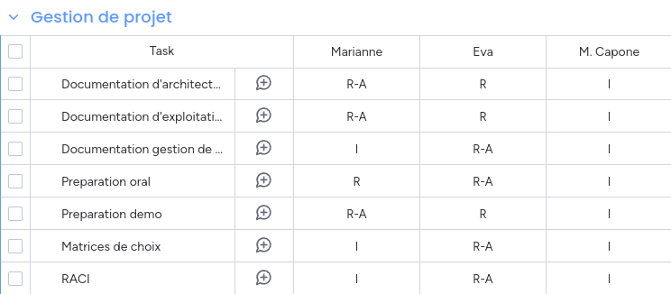

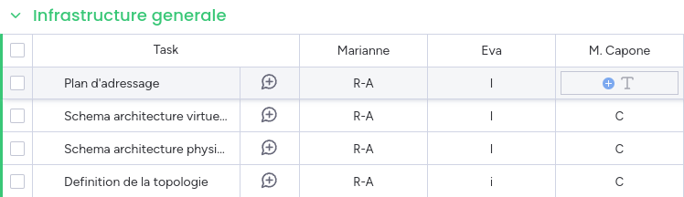

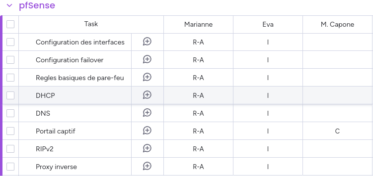

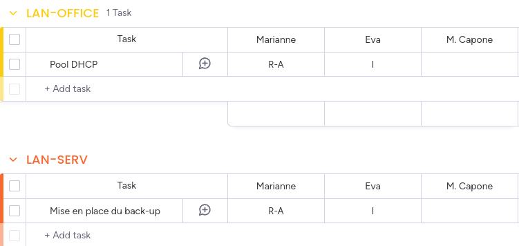

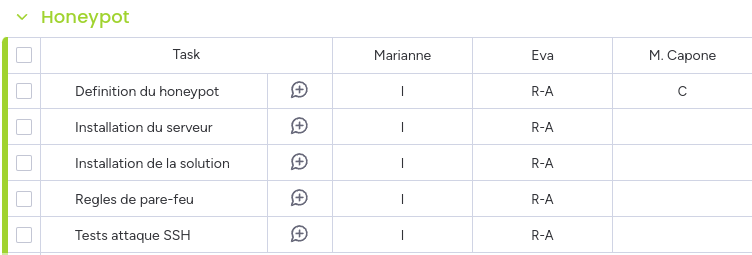

## Matrices de choix
### Choix de la solution pour la gestion de projet
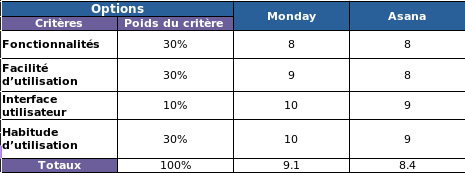

Asana et Monday sont relativement proches dans leur mode de fonctionnement et les fonctionnalités proposées, mais Monday offre un meilleur confort au niveau de l'interface.

### Choix de la solution pour la documentation hebergée

Nous avions besoin d'un site statique afin de permettre une disponibilité permanente sur des solutions faciles et gratuites d'hébergement comme Github Pages, ainsi que sur le serveur web de l'architecture.
Il nous fallait aussi une solution nous permettant l'édition de la documentation en Markdown.

Docusaurus et MkDocs étaient deux candidats ideaux, mais Docusaurus l'a emporté par pur choix esthétique.

### Choix de la solution pour le système d'exploitation
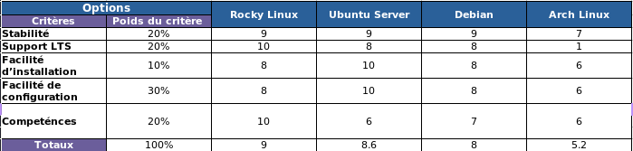

Rocky Linux remplit tous les critères nécessaires, d'autant plus en ayant pris en consideration notre expérience avec cette distribution Linux, acquise cette année à travers les cours dispensés par [M. Kovacs](https://microlinux.fr).

### Choix de la solution pour le honeypot
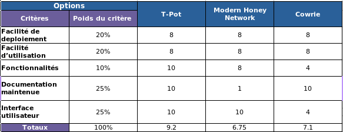

T-Pot est idéal car il propose une solution intégrée avec des fonctionnalités avancées, une documentation bien maintenue, et une interface utilisateur sophistiquée permettant la visualisation de données.
MHN offre une bonne solution pour la gestion centralisée de plusieurs honeypots, mais souffre d'une documentation qui n'est maintenant plus maintenue.
Cowrie est adapté pour des déploiements spécifiques de honeypots SSH/Telnet avec une bonne documentation, mais manque de fonctionnalités avancées et d'une interface utilisateur graphique.

## Objectifs atteints (planning prévisionnel / planning réel)

### Mesures d'écart
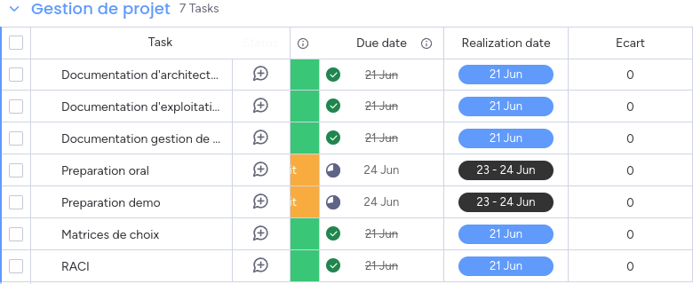

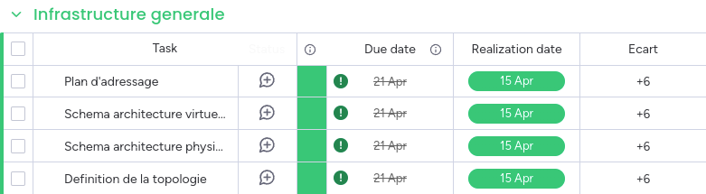

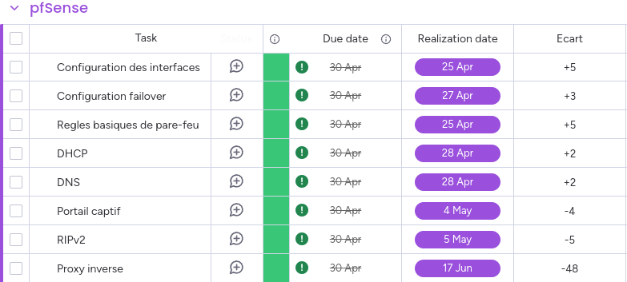

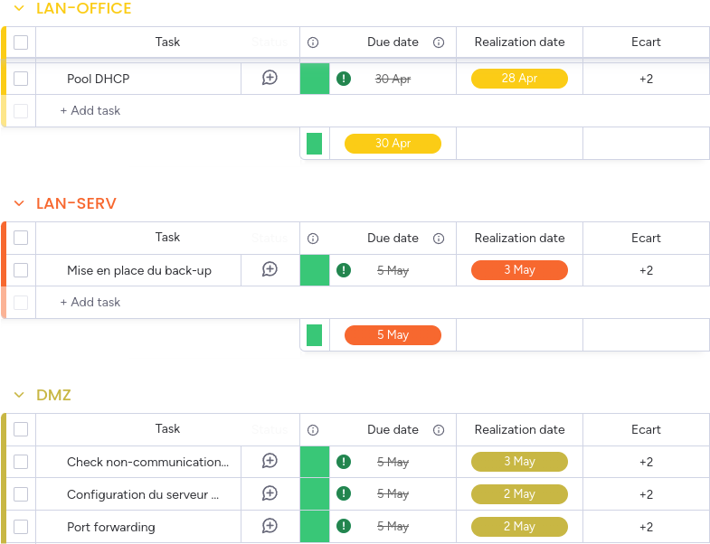

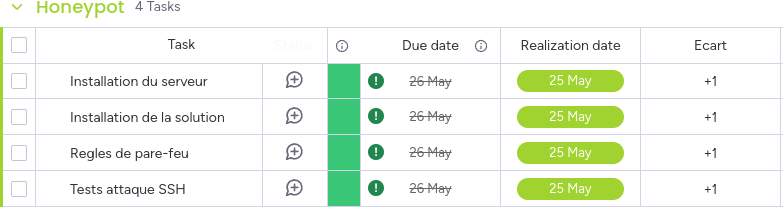

Nous avons établi des échéances pour les principaux éléments clés du projet par catégories. La plupart des tâches ont été achevées avant les délais fixés, à l'exception de certaines tâches liées au pfSense telles que le Proxy inverse, le portail captif et le RIPv2.

La contrainte de gestion de projet est très proche de la date de livraison, mais aurait dû être anticipée et finalisée plus tôt par mesure de précaution. Toutes les tâches ont été accomplies, à l'exception de la préparation de la présentation orale et de la démonstration, qui sont en cours et seront achevées avant la date prévue (un jour avant la présentation).

### Notes de remédiation
Pour éviter que la gestion des contraintes de projet ne soit réalisée trop près de la date de livraison, nous pourrions entreprendre les actions suivantes :
- Anticiper les risques en mettant en analysant les potentiels retards
- Organiser des revues periodiques pour evaluer l'avancement, les contraintes et les risques

Les tâches liées a pfSense ont été reportées en raison d'une charge de travail trop conséquente sur entre les mois de février et mai.

Pour éviter que cela ne se reproduise, nous pourrions entreprendre les actions suivantes :
- Réévaluer régulièrement la répartition de notre charge de travail pour chaque tâche
- Optimiser la gestion des tâches au sein d'une catégorie développée